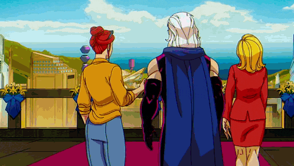

 
 

<i style="color: #FF00FF;">"It wasn't a Gamble, it was a Gambit."</i>

 

---

 

 

<table style="border: none; background-color: transparent;">
  <tr style="border: none;">
    <td align="center" style="border: none;"> Linux</td>
    <td align="center" style="border: none;"> Ubuntu</td>
    <td align="center" style="border: none;"> Windows</td>
    <td align="center" style="border: none;"> Docker</td>
    <td align="center" style="border: none;"> Python</td>
    <td align="center" style="border: none;"> Bash</td>
    <td align="center" style="border: none;"> JS</td>
    <td align="center" style="border: none;"> HTML</td>
    <td align="center" style="border: none;"> CSS</td>
  </tr>
  <tr style="border: none;">
    <td align="center" style="border: none;"> Kali Linux</td>
    <td align="center" style="border: none;"> Wireshark</td>
    <td align="center" style="border: none;"> Grafana</td>
    <td align="center" style="border: none;"> Burp Suite</td>
    <td align="center" style="border: none;"> Metasploit</td>
    <td align="center" style="border: none;"> Splunk</td>
    <td align="center" style="border: none;"> Proxmox</td>
    <td align="center" style="border: none;"> Tailscale</td>
    <td align="center" style="border: none;"> Guacamole</td>
  </tr>
</table>

